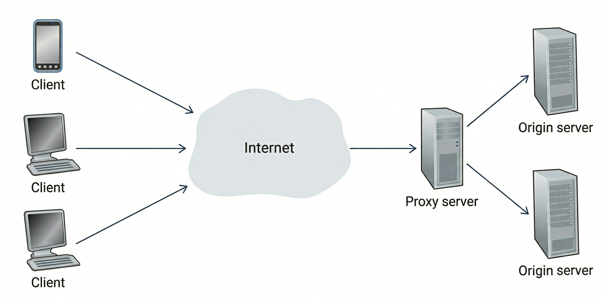

# Ratelimit

A lightweight rate limiting API gateway built in Go with Redis.

[//]: # (TODO: Demo video)

Sits as a reverse proxy in front of a backend service and enforces per-IP and 
per-endpoint rate limits using a sliding-window counter stored in Redis.
Returns HTTP 429 when a client exceeds the configured threshold.
Includes an admin endpoint for viewing live rate limit statistics.


## Tech Stack

- **Go** — HTTP server, reverse proxy, middleware chain
- **Redis** — shared rate limit counter store
- **YAML** — configuration


## Quick Start

### Prerequisites

- Go 1.25+
- Redis 7+
- Git

### Run

```bash
# Start Redis (Docker)
docker run -d --name redis -p 6379:6379 redis:7-alpine

# Clone and build
git clone https://github.com/prestonhemmy/ratelimit.git
cd ratelimit
go build -o gateway.exe ./cmd/gateway

# Flush stale Redis data from previous run (optional)
redis-cli FLUSHALL

# Start the gateway
./gateway.exe
```

### Test

```bash
# Send requests through the gateway
curl http://localhost:8080/get

# Exhaust the /post rate limit (5 req/min default)
for i in $(seq 1 6); do curl -s -o /dev/null -w "%{http_code}\n" -X POST http://localhost:8080/post; done

# Check rate limit stats
curl -s http://localhost:8080/admin/stats | jq .
```


## Configuration

Edit `configs/config.yaml` to set the backend URL, server port and rate limit rules.

```yaml
server:
  port: 8080

backend:
  url: "https://httpbin.org"

rate_limit:
  enabled: true
  default:
    requests: 10
    window_seconds: 60    # 10 requests per minute
  per_endpoint:
    - path: "/post"
      requests: 5
      window_seconds: 60  # 5 'post' requests per minute
```


## Architecture

---

<div style="display: flex; justify-content: center">
    
</div>

---

Every incoming request passes through a middleware chain:

1. **Rate limit middleware** — Checks a sliding window counter in Redis. If the client has exceeded their 
    per-IP/per-endpoint limit the request is rejected with HTTP code 429.
2. **Reverse proxy** — Forwards allowed requests to the configured backend and returns the response to the client.

A separate `/admin/stats` endpoint reads counters from Redis and returns a JSON summary of active clients, request 
counts, limits and TTLs.


## Author

**Preston Hemmy**

GitHub: [@prestonhemmy](https://github.com/prestonhemmy)

LinkedIn: [Preston Hemmy](https://linkedin.com/in/prestonhemmy)